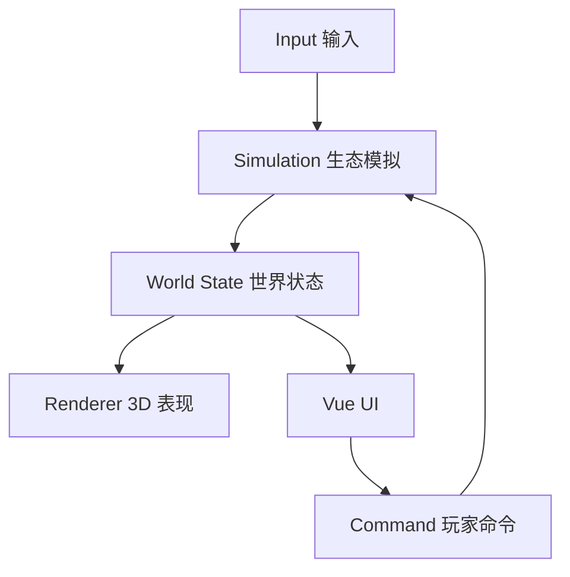
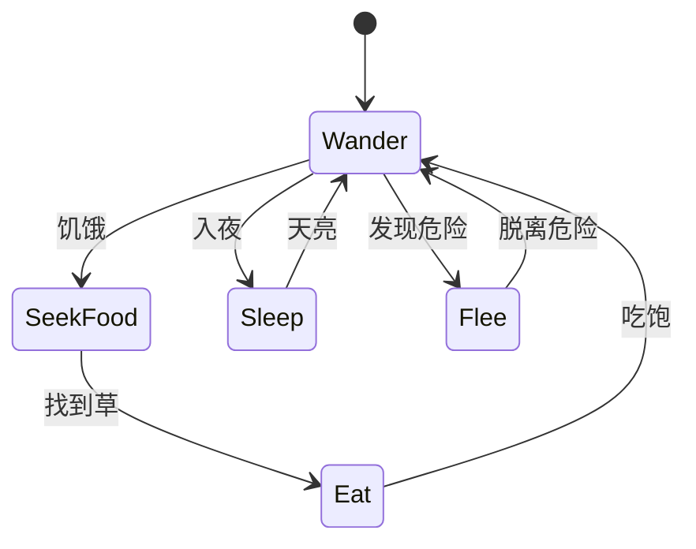

我最推荐这一套：

> **Vite + TypeScript + Vue 3 + Three.js + Pinia**

先做成浏览器游戏，成熟后再决定是否用 Tauri 打包桌面版。它与这个“小星球生态游戏”的规模、你的技术背景以及 Code Agent 的生成能力比较匹配。

## 推荐技术栈

| 层次    | 技术                        | 用途                          |
| ----- | ------------------------- | --------------------------- |
| 构建工具  | Vite                      | 开发服务器、构建和资源管理               |
| 语言    | TypeScript                | 游戏对象、状态、事件的数据建模             |
| UI    | Vue 3                     | 工具栏、属性面板、事件卡、星球日志           |
| 状态管理  | Pinia                     | 资源、时间、天气、玩家进度               |
| 3D 渲染 | Three.js                  | 星球、植物、动物、光照、云层              |
| 3D 模型 | Blender + glTF/GLB        | 后期制作动物、建筑和装饰模型              |
| 音频    | Web Audio API / Howler.js | 环境声、动物声、昼夜音效                |
| 存档    | IndexedDB                 | 保存完整星球状态                    |
| 单元测试  | Vitest                    | 测试生态规则、资源计算和存档              |
| 端到端测试 | Playwright                | 测试启动、种植、存档等关键流程             |
| 桌面打包  | Tauri 2，可选                | 后期发布 Windows/macOS/Linux 版本 |

## 为什么选择 Vue 3 + 原生 Three.js

你熟悉 Vue，而游戏的大部分界面本质上仍是普通应用界面：

- 资源计数器；

- 时间控制；

- 植物和建筑选择器；

- 动物信息面板；

- 任务与随机事件；

- 设置和存档管理。

这些用 Vue 做很自然。

Three.js 只负责画布内的三维世界：

```text
Vue
├── 顶部资源栏
├── 左侧建造菜单
├── 右侧对象信息
├── 星球日志
└── Three.js Canvas
    ├── 星球
    ├── 地形
    ├── 植物
    ├── 动物
    ├── 设施
    └── 光照、云层和粒子
```

我倾向于**直接使用 Three.js API**，暂时不引入 TresJS 之类的 Vue 声明式封装。这个游戏存在大量球面坐标计算、实例化渲染、动物移动和动态对象管理，直接操作 Three.js 对象更明确，也更便于 Code Agent 排查生命周期与性能问题。

Three.js 目前同时提供传统 `WebGLRenderer` 和新的 `WebGPURenderer`；后者会优先使用 WebGPU，并能回退到 WebGL 2。[Three.js 官方文档](https://threejs.org/docs/pages/WebGPURenderer.html)

第一版建议使用成熟的 **WebGLRenderer**。等游戏机制稳定、确实需要大量实例或 GPU 计算时，再评估 WebGPU，不要让渲染技术升级干扰核心玩法验证。

## 最重要的架构决策

不要把所有逻辑写进一个 `Game.vue` 或 `main.ts`。把游戏分为三个基本部分：



### 1. Simulation：纯逻辑层

负责：

- 植物生长；

- 动物饥饿和移动；

- 土壤湿度；

- 光照和温度；

- 昼夜变化；

- 资源生产；

- 随机事件。

这一层尽量只操作普通 TypeScript 数据，不直接依赖 Three.js。

例如：

```ts
interface PlantState {
  id: string
  species: PlantSpecies
  position: SurfacePosition
  age: number
  health: number
  water: number
  growth: number
}
```

这样生态规则可以单独测试，将来更换渲染方案也不会影响游戏逻辑。

### 2. Renderer：表现层

负责将状态变成画面：

- 根据植物状态设置模型大小和颜色；

- 根据动物位置更新模型朝向；

- 播放走路、进食和休息动画；

- 显示昼夜、阴影、云层和天气；

- 处理射线拾取和星球转动。

它不决定“兔子是否饿了”，只负责把饥饿兔子的状态表现出来。

### 3. Vue UI：交互层

Vue 不应该每帧响应全部 3D 对象的位置。否则几百个对象不断触发响应式更新，会产生不必要的开销。

Pinia 中只放适合 UI 使用的状态：

- 当前资源；

- 游戏速度；

- 当前选中的对象；

- 当前工具；

- 任务和通知；

- 全局生态指标。

动物每一帧的位置保留在游戏世界中，不需要全部放入 Pinia。

## 球面世界的数据表示

这是整个项目最关键的技术基础。

不要把植物和动物的位置主要保存为普通世界坐标 `x/y/z`，而是保存为：

```ts
interface SurfacePosition {
  normal: Vector3
  altitude: number
}
```

其中 `normal` 是从星球中心指向表面的单位向量。

世界坐标可计算为：

```ts
worldPosition = normal * (planetRadius + altitude)
```

这能自然解决：

- 植物放在球面上；

- 建筑始终朝向球面外侧；

- 动物绕星球移动；

- 根据表面法线计算光照；

- 调整星球半径；

- 保存和恢复对象。

对象朝向可以使用：

```ts
object.quaternion.setFromUnitVectors(
  new THREE.Vector3(0, 1, 0),
  surfaceNormal
)
```

动物移动时，需要在当前位置的**切平面**上产生方向：

```ts
tangentDirection.projectOnPlane(surfaceNormal).normalize()
```

移动后重新归一化到球面：

```ts
normal.addScaledVector(tangentDirection, speed * dt).normalize()
```

这是“小星球上动物行走”最核心的一组数学关系。

## 星球地形怎么做

第一版用：

```ts
new THREE.IcosahedronGeometry(radius, detail)
```

然后根据噪声稍微改变每个顶点的半径，形成柔和起伏。

推荐：

- 星球主体使用低多边形风格；

- 海洋用一个稍小或稍大的独立球体；

- 植被根据高度、湿度和温度分布；

- 暂时不要做真正的可破坏体素地形；

- 暂时不要追求连续编辑山脉和河流。

如果用规则的经纬球体，极点附近三角形会非常密集；`IcosahedronGeometry` 的面分布更加均匀，适合程序化小行星。

## 动物系统不要一开始引入完整 ECS

ECS 很适合大规模游戏对象，但第一版可能只有：

- 几十棵树；

- 十几只兔子；

- 几只鸟；

- 少量建筑。

可以先使用：

```ts
interface GameEntity {
  id: string
  type: EntityType
  components: EntityComponents
}
```

再把行为拆成系统：

```text
GrowthSystem
NeedsSystem
MovementSystem
BehaviorSystem
ClimateSystem
ReproductionSystem
RenderSyncSystem
```

这已经具备 ECS 的主要优点，同时便于 Code Agent 理解。等对象达到几千个、性能分析确认数据布局有问题后，再考虑 `bitecs` 等正式 ECS 库。

## 动物 AI：有限状态机足够

第一版的兔子可以有五个状态：



每隔 `0.2～0.5` 秒运行一次动物决策即可，渲染仍然保持每帧更新。行为 AI 没必要以 60 Hz 执行。

这种设计可以显著降低计算量，也让动物行为更容易调试。

## 物理引擎暂时不要加入

Rapier 是很好的 WebAssembly 物理引擎，也有官方 JavaScript 包和 SIMD 支持。[Rapier 官方说明](https://rapier.rs/)

但这个游戏的大多数对象附着在球面上，真正需要的是：

- 球面移动；

- 简单距离检测；

- 射线选择；

- 建筑放置冲突检测；

- 少量粒子效果。

Three.js 的 `Raycaster`、包围球和自定义距离检测足够。通用物理引擎反而会引入“径向重力”“球面站立”“刚体朝向”等额外问题。

只有以后增加这些玩法时再引入 Rapier：

- 可以滚动的石块；

- 砍倒树木；

- 建筑倒塌；

- 车辆碰撞；

- 具有实体碰撞的角色控制。

## 性能策略

小星球看似很小，但树木、草、花朵很容易达到几千个。需要尽早确定以下规则：

### 使用 `InstancedMesh`

相同类型的草、树和石头共享：

- 几何体；

- 材质；

- 一次或少量绘制调用。

每个实例只保存变换矩阵和少量颜色数据。

### 模拟频率与渲染频率分离

```text
渲染：最多 60 FPS
动物移动：20～30 Hz
动物决策：2～5 Hz
植物生长：1 Hz
生态统计：0.2～1 Hz
自动存档：30～60 秒一次
```

### 控制像素比

高分辨率屏幕不要无条件使用完整的 `devicePixelRatio`：

```ts
renderer.setPixelRatio(Math.min(devicePixelRatio, 2))
```

你的 2880×1800 屏幕如果使用过高像素比，GPU 开销会明显上升。

## 存档设计

初期可以用 LocalStorage，但只适合少量设置。正式存档建议直接使用 IndexedDB，保存：

```ts
interface SaveGame {
  schemaVersion: number
  seed: number
  gameTime: number
  planet: PlanetState
  entities: SerializedEntity[]
  resources: ResourceState
  events: HistoricalEvent[]
}
```

必须从第一版就保留 `schemaVersion`。游戏持续开发后，数据结构一定会变化，没有版本号就很难兼容旧存档。

随机世界还要保存 `seed`。如果所有程序化生成都使用确定性随机数，同一存档就能稳定恢复。

## 目录结构建议

```text
src/
├── app/
│   ├── App.vue
│   ├── stores/
│   └── components/
├── game/
│   ├── Game.ts
│   ├── loop/
│   ├── world/
│   ├── entities/
│   ├── systems/
│   ├── commands/
│   └── events/
├── rendering/
│   ├── ThreeRenderer.ts
│   ├── PlanetView.ts
│   ├── EntityView.ts
│   ├── effects/
│   └── assets/
├── simulation/
│   ├── climate/
│   ├── ecology/
│   └── behaviors/
├── persistence/
│   ├── SaveRepository.ts
│   └── migrations/
└── shared/
```

核心依赖关系应保持为：

```text
simulation → 不依赖 Vue、Three.js
rendering  → 读取游戏状态
Vue UI     → 发出玩家命令
persistence → 序列化纯状态数据
```

## Code Agent 最容易成功的实施顺序

不要让它一次生成完整游戏。按照可验证的垂直切片逐步开发：

1. 创建 Vite、Vue 3、TypeScript 工程；

2. 显示一个可拖动旋转的小星球；

3. 点击球面，显示落点标记；

4. 在落点放置一棵始终朝外的树；

5. 加入太阳、昼夜分界和星球自转；

6. 让树根据光照逐渐生长；

7. 加入一只能够沿球面行走的兔子；

8. 兔子寻找最近的草并进食；

9. 添加时间控制和对象信息面板；

10. 加入 IndexedDB 存档；

11. 批量生成草木并使用 `InstancedMesh` 优化；

12. 最后才做天气、建筑、声音和随机事件。

前三步验证球面交互，第六步验证模拟与渲染分离，第八步验证游戏是否开始“活起来”。

如果希望做一个体验优先、可持续扩展的小作品，**Vue 3 + 原生 Three.js 是最稳妥的选择**。Unity 和 Godot也能实现，但它们会增加编辑器、场景资源和引擎工作流；对于 Code Agent 主导、浏览器直接运行、程序化生成占主导的项目，TypeScript 技术栈开发反馈会更快。
