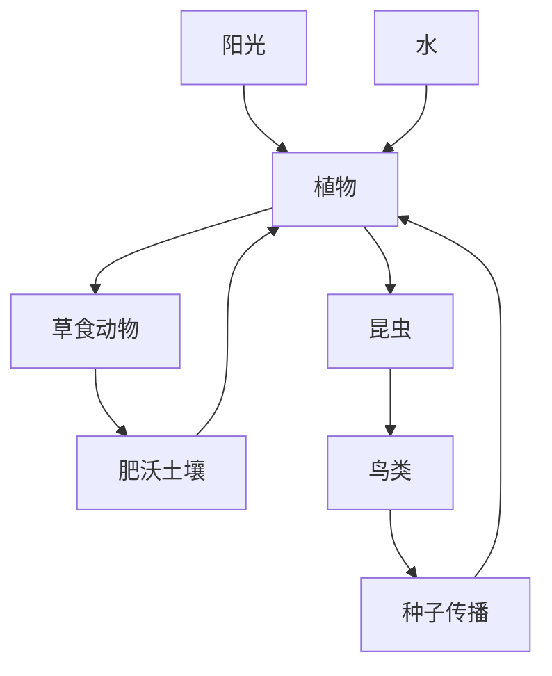

## 创意：《星球值日生》

你接管了一颗刚刚苏醒的小星球。

星球只有几十米大小，上面原本寸草不生。你可以转动星球、播种植物、引入动物、修建设施，慢慢建立一个会自行运转的微型生态系统。

真正特别的地方是：

> **星球很小，同一时间只有朝向太阳的一面获得阳光；玩家通过转动星球，控制每个区域经历白天、黄昏和黑夜。**

你既是建设者，也是这颗星球的“自转控制者”。

---

## 核心玩法

### 1. 转动星球就是控制时间

玩家拖动鼠标旋转星球。

不同区域根据朝向产生变化：

| 环境    | 产生的影响             |
| ----- | ----------------- |
| 阳光直射  | 植物生长、太阳能设施发电、水分蒸发 |
| 黄昏区域  | 动物回巢、夜行动物出现       |
| 黑夜区域  | 温度下降、蘑菇生长、萤火虫出现   |
| 长时间暴晒 | 土壤干裂、植物枯萎、湖泊缩小    |
| 长时间黑暗 | 植物停止生长、积雪或结霜      |

因此不能一直让某一面朝着太阳。玩家需要缓慢旋转星球，让生态系统得到适当的昼夜循环。

这会让“拖动一个漂亮的小星球”具有实际意义，而不只是调整观察角度。

---

## 2. 星球是一个相互关联的小生态系统

玩家开始时只有三样东西：

- 一片土壤

- 一小池水

- 一颗“生命种子”

种下植物以后，会逐渐形成这样的关系：

例如：

- 草会吸引兔子；

- 花会吸引蜜蜂；

- 蜜蜂帮助附近植物繁殖；

- 树木会形成阴影，让水分蒸发得更慢；

- 鸟会把种子带到星球另一面；

- 狐狸数量过多，会让兔子减少；

- 兔子过多，又会把草地吃光。

玩家不是简单地“解锁并放置更多东西”，而是在调整关系。

---

## 3. 每颗星球都会形成自己的性格

根据玩家的选择，星球会逐渐呈现不同状态：

| 星球类型 | 形成条件      | 外观与行为      |
| ---- | --------- | ---------- |
| 花园星球 | 植物多、气候温和  | 花海、蝴蝶、鸟群   |
| 森林星球 | 大量树木、降水充足 | 云雾、溪流、鹿    |
| 机械星球 | 设施多、能源充足  | 风车、轨道、小机器人 |
| 荒漠星球 | 日照过多、水源不足 | 沙丘、仙人掌、蜥蜴  |
| 夜光星球 | 黑夜较长、真菌繁盛 | 发光蘑菇、萤火虫   |
| 混沌星球 | 生态失衡      | 风暴、枯木、动物迁徙 |

这些不是开局选择，而是游戏运行过程中自然形成的结果。

---

## 4. 小动物不只是装饰

每种动物只需要两三种简单行为，就能让星球显得“活着”。

例如兔子：

1. 在出生地附近游荡；

2. 饿了以后寻找草；

3. 天黑后寻找树木或洞穴；

4. 遇到狐狸时逃跑；

5. 数量达到一定条件后繁殖。

鸟类可以绕着整个星球飞行，并偶尔落在树上。玩家转动星球时，还能看到鸟群从星球背面飞出来。

机器人则可以：

- 给缺水的植物浇水；

- 搬运果实；

- 修理风车；

- 在夜间打开头灯巡逻。

这样植物、动物和设施便能产生可观察的小故事。

---

## 5. 玩家不是全能的上帝

每次操作消耗一种名为“星尘”的资源：

- 播种植物；

- 引入动物；

- 建造设施；

- 改造地形；

- 降下一场小雨。

星尘主要由健康生态自行产生。生态系统越稳定，玩家能够做的事情越多。

如果生态失衡，玩家不能直接无限放置资源，只能通过有限的干预帮助星球恢复。

---

## 6. 随机事件带来短期目标

游戏每隔一段时间出现一张事件卡：

- **流星坠落**：留下矿石，也可能引发火灾；

- **迁徙旅客**：一群鸟请求停留；

- **漫长寒夜**：未来几个昼夜温度下降；

- **奇怪的种子**：可能长出新品种；

- **干旱季节**：湖泊蒸发速度加快；

- **机械访客**：带来新设施，也会消耗能源；

- **星球低语**：星球希望拥有一片森林或一座灯塔。

玩家需要决定是否接受。有些事件会在很久以后产生结果，例如当初收留的候鸟可能带回一种新植物。

---

## 7. 可以加入一个很有情感的核心：星球日志

系统自动记录发生过的小事件：

> 第 3 天，第一棵树长大了。  
> 第 5 天，两只兔子在树下安了家。  
> 第 8 天，西半球经历了一场大雨。  
> 第 11 天，一只鸟把种子带到了北方。  
> 第 17 天，玩家修建了第一座灯塔。  
> 第 26 天，那只最早出现的兔子老去了。

玩家可以随时打开日志，回看这颗星球从荒芜到繁荣的过程。

长期游玩后，玩家对星球的感情主要来自这些自然形成的历史，而不只是解锁了多少建筑。

---

## 美术方向

我建议采用**低多边形微缩模型风格**：

- 星球半径不大，一眼能看到大约三分之一；

- 树木、房屋、动物略微夸张；

- 海洋和湖泊带有柔和反光；

- 云朵在星球外层缓慢旋转；

- 设施具有细微动画，例如风车旋转、烟囱冒烟、灯塔扫光；

- 背景使用深蓝色宇宙与少量星尘；

- 色彩清爽，避免过度偏黄、偏橙。

这种风格对素材精度要求较低，也很适合 Code Agent 用 Three.js 程序化生成。

---

## 最适合先实现的 MVP

第一版控制在这些内容内：

1. 一个可拖动旋转、可缩放的低多边形星球；

2. 固定方向的太阳和可视化昼夜分界；

3. 在星球表面点击并种下一棵树；

4. 树木根据光照和水分生长；

5. 一小片湖泊；

6. 兔子在球面上游荡并寻找草；

7. 太阳、湖泊、植物和兔子构成最小生态循环；

8. 简单时间加速与暂停；

9. 一个显示光照、水分和生态稳定度的界面。

第一版的“成功画面”应该是：

> 玩家转动星球，让一片草地进入阳光；草逐渐生长，两只兔子从星球背面跑过来吃草，远处的树木在风中轻轻摇动。

只要这个场景成立，游戏就已经有吸引力了。

技术上可以采用：

- **Vite + TypeScript**

- **Three.js**

- 球面采用 `IcosahedronGeometry`

- 植物和动物用 `InstancedMesh`

- 经纬度或单位向量表示物体在星球上的位置

- 动物沿球面切线方向移动

- `dot(surfaceNormal, sunDirection)` 计算光照

- 简单状态机驱动动物行为

- IndexedDB 或 LocalStorage 保存星球状态

这个创意的优势是视觉效果直接、第一版规模可控，并且后续很容易不断增加植物、动物、天气、建筑和随机事件。核心机制也足够明确：**你通过转动星球，为生活在不同区域的生命分配阳光与黑夜。**
